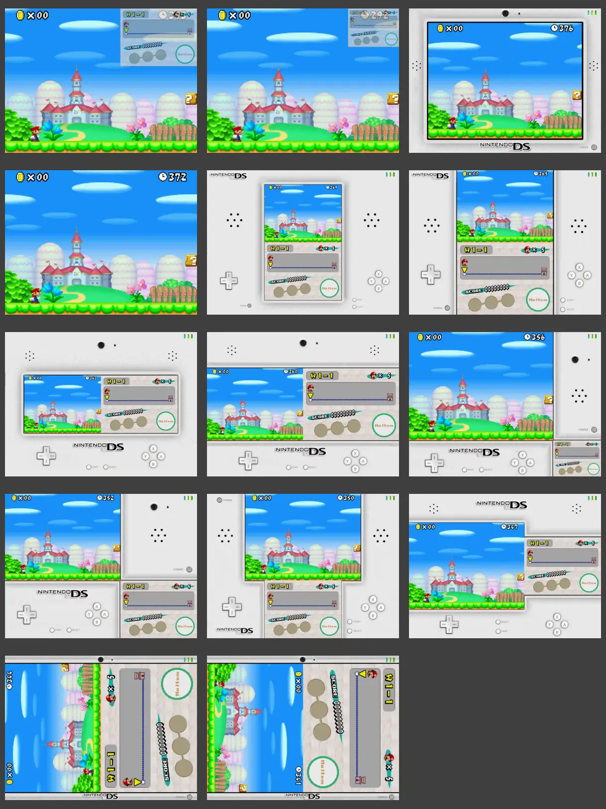

# Nintendo - DS ✔

- Alias: *DS*, *NDS*
- Emulator: **Drastic**
- Rom Folder: `NDS`
- Extensions: `.nds` `.zip` `.7z` `.rar`
- Bios: None

Nintendo DS emulator has been ported to Miyoo Mini by Steward-Fu.

The DS console had 2 screens so R2 key allow you to switch between these 2 screens. It's also possible to display both screens at the same time. Then <kbd>L2</kbd> allows to display the stylus and then DPAD is used to move touch pen and A button acts touch point.

The Drastic (<kbd>Menu</kbd> + <kbd>Select</kbd> ) menu has been revised and a new custom has been created to offer you more settings (CPU speed, display disposition, ... ).

Drastic is the first standalone emulator (not RetroArch core) which is compatible with Onion game Switcher : you can power-off the device and resume it at boot, you can browse your last played NDS games in the game Switcher.

Drastic is compatible with the Miyoo Mini v4 resolution (752 x 560).

For more details about advanced configuration check the [Steward-Fu Drastic Github repository](https://github.com/steward-fu/nds/blob/master/README.mdetting-file-drasticresourcessettingsjson).

## Hotkeys

### In game Hotkeys

|  Keys               | Description                         |
| ------------------- | ----------------------------------- |
| <kbd>R2</kbd>                  | Swap screen                         |
| <kbd>L2</kbd>                  | Change Keypad mode / Stylus mode    |
| <kbd>MENU</kbd> + <kbd>LEFT</kbd>         | Change the display layout           |
| <kbd>MENU</kbd> + <kbd>RIGHT</kbd>        | Change the display layout           |
| <kbd>MENU</kbd> + <kbd>L1</kbd>           | Exit from DraStic emulator          |
| <kbd>MENU</kbd> + <kbd>L2</kbd>           | Quick load state                    |
| <kbd>MENU</kbd> + <kbd>R1</kbd>           | Fast forward                        |
| <kbd>MENU</kbd> + <kbd>R2</kbd>           | Quick save state                    |

### Keypad Mode

|  Keys               | Description                         |
| ------------------- | ----------------------------------- |
| <kbd>MENU</kbd> + <kbd>A</kbd>            | Alternate display layout            |
| <kbd>MENU</kbd> + <kbd>B</kbd>            | Change video filter (blur or pixel) |
| <kbd>MENU</kbd> + <kbd>Y</kbd>            | Change background image             |
| <kbd>MENU</kbd> + <kbd>SELECT</kbd>       | Enter the DraStic menu              |
| <kbd>MENU</kbd> + <kbd>START</kbd>        | Enter the customized menu           |

### Stylus Mode

|  Keys               | Description                         |
| ------------------- | ----------------------------------- |
| <kbd>DPAD</kbd>                | Move the pen                        |
| <kbd>A</kbd>                   | Touch screen                        |
| <kbd>R1</kbd>                  | Lower moving speed                  |
| <kbd>MENU</kbd> + <kbd>UP</kbd>           | Show the pen on screen 1            |
| <kbd>MENU</kbd> + <kbd>DOWN</kbd>         | Show the pen on screen 0            |
| <kbd>MENU</kbd> + <kbd>Y</kbd>            | Change the pen image                |

### Customized Menu

|  Keys               | Description                         |
| ------------------- | ----------------------------------- |
| <kbd>UP</kbd> / <kbd>DOWN</kbd>           | Select item                         |
| <kbd>LEFT</kbd> / <kbd>RIGHT</kbd>        | Change setting                      |
| <kbd>B</kbd>                   | Apply change and then exit          |

&nbsp;

## Available screen layouts

## Migration from previous Drastic versions

If you have installed Drastic manually with Steward-Fu version before Onion 4.3.0 then your Drastic installation will be migrated during the installation of Onion 4.3.0.
All your saves and save states will be automatically moved to `Saves/CurrentProfile/states/Drastic`, the official Drastic version compatible with Onion will be automatically installed and your old manual Drastic installation will be removed. Your roms will not move.

Note that you'll find a backup of your previous NDS installation in `Emu/NDS_old.7z` or `Emu/drastic_old.7z`.

