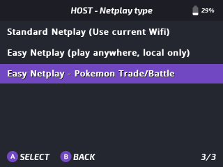
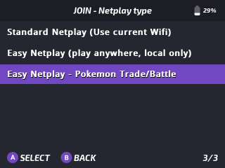

# Easy Netplay - Pokémon trade/battle (GB/GBC)

**

Trade and battle with your friends, the easy way. With Onion and RetroArch Netplay, you can effortlessly setup a session to trade those hard to acquire Pokémon without save editing. This feature simplifies the process by eliminating the need for complex setups or additional hardware, allowing players to connect and trade seamlessly with friends.

https://www.youtube.com/watch?v=8-GnEP1zC6g

## Features

- 1-click automated host setup

- 1-click automated client setup

- Save synchronization

- Backup process to avoid any data loss

:::info No GBA support
This feature only supports **GB** and **GBC** games (**Red**, **Blue**, **Yellow** / **Gold**, **Silver**, **Crystal**)  
:::

## Usage

Trades tested and working:

- **Red** ↔ **Blue** ↔ **Yellow**

- **Crystal** ↔ **Crystal**

For the process goes as smooth as possible, make sure you:

1. Have matching Roms within their respective platform locations: `GB` or `GBC` on each Miyoo

2. Have save files who's name matches the rom's name perfectly

3. Have a stable connection throughout the trade until completion - don't wander too far away from each other!

4. Exit RetroArch gracefully - the process isn't complete until after you exit RetroArch via the menu:  
   <kbd>MENU</kbd>+<kbd>SELECT</kbd> › <kbd>B</kbd> › <b>Quit RetroArch</b>

If you've followed the above, you've likely just completed your first trade evolution with a friend! Nice!

## Connecting

### As the host

Setting up the host is as easy as:

1. Finding the Pokémon rom in the Games submenu

2. Press <kbd>Y</kbd> to open GLO

3. Choose `Netplay` -> `Host` -> `Easy Netplay - Pokemon Trade/Battle`
 
Onion will now take over and setup a session on the built in personal hotspot.

### As the client

As with the host, getting connected as a client is just as simple:

1. Find the Pokémon game you wish to load, it doesn't have to be the same game as the host, just the same gen!

2. Press <kbd>Y</kbd> to open GLO

3. Choose `Netplay` -> `Join` -> `Easy Netplay - Pokemon Trade/Battle`
 
Onion will now take over and join the hotspot, pull the information from the host and connect! 

## Safe saves, always.

If something happens along the way, don't worry. We've got you covered. 

In the TGB Dual folder, aswell as your actual save file you'll find a backup from just before the trade.

If anything goes wrong, quit RetroArch. Head over to: `Saves/CurrentProfile/saves/TGB Dual` and look for a file with the name ending `_bkup` - Remove this `_bkup` tag and restart RetroArch and all shall be saved - depending on your load save state setting you may need to temporarily move your save states to force load the backup save, then take a new save state.

:::info
If you change the hotspot password on the host then this process will fail. It should be left as `onionos+`.
:::

Useful additional information [here](https://github.com/OnionUI/Onion/pull/1007)
