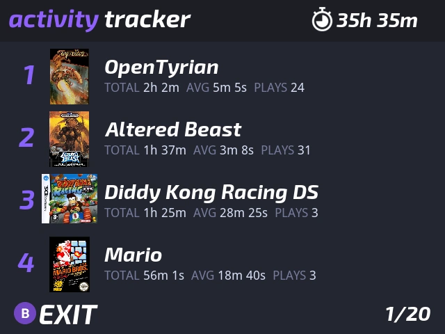

# Activity Tracker

<i>{frontMatter.description}</i>

## Presentation

Activity Tracker tracks your game time for all the games you play! Also shows your overall play time in the top bar.

Thanks to `Activity Tracker` app you can: 
- Track your game playtimes
- View your total playtime in the top bar
- Share your playtimes by taking a screenshot (press <kbd>MENU</kbd>+<kbd>POWER</kbd> - screenshot is saved in `Screenshots` folder)

## Usage

Activity Tracker is installed by default in Onion.

For each game you'll see:
- `TOTAL`: total playtime on this game
- `AVG`: average session time on this game
- `PLAY`: number of times you have launched the game

### Controls

| Button          | Function                                 |
| --------------- | -----------------------------------      |
| <kbd>Y</kbd>    | Toggle between full and short game names |
| <kbd>B</kbd>    | Exit                                     |

## Advanced

[Activity Tracker source code](https://github.com/OnionUI/Onion/tree/main/src/playActivityUI).

