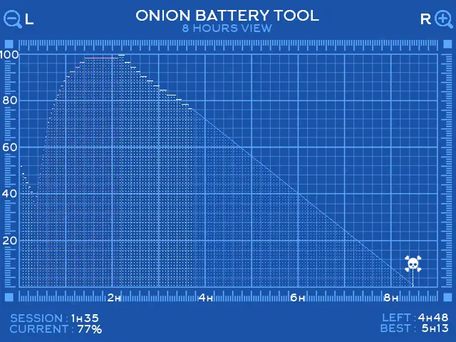

#  Battery Tool

<i>{frontMatter.description}</i>

## Presentation

Onion Battery Tool enables to track and monitor historical battery charge while also providing an estimate of the remaining gaming time.

## Usage

Battery Monitor is available in the Apps section of [Package Manager](package-manager).

Onion is recording your daily battery usage, so you can view it graphically just by installing Onion Battery Tool. The battery is monitored only when the device is ON. 
Onion Battery Tool will allow you to see a little more than the last 24h of use of your battery.

### Controls

| Button          | Function                                 |
| --------------- | -----------------------------------      |
| D-pad <kbd>right</kbd> / <kbd>left</kbd> | Scroll left/right when the view is zoomed  |
| <kbd>L/L2</kbd>    | Zoom out (4, 8 or 16 hours displayed) |
| <kbd>R/R2</kbd>    | Zoom out (4, 8 or 16 hours displayed) |
| <kbd>B</kbd>    | Exit                                     |

## Advanced

[Activity Tracker source code](https://github.com/OnionUI/Onion/tree/main/src/batteryMonitorUI).

## Key points to note

It remains device-independent, even if you switch SD cards to another device. It also continue to monitor if the user switch profile.

The log database only adds/update a new entry only when a significant battery increment is detected.

It performs a final update upon detecting a SIGTERM or a change in the charging state.
The log database follows a FILO (First-In, Last-Out) management strategy to limit its size.

## Limitations

Due to the battery-friendly nature of batmon, there may be up to a 5-minute delay in the graph compared to the real battery state. It is not really noticeable.
