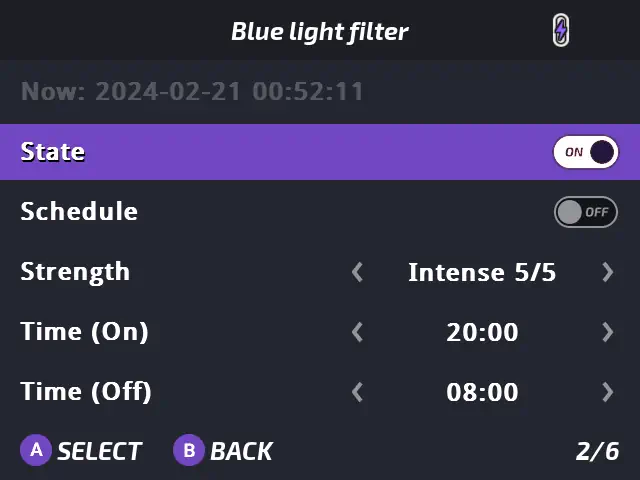

# Blue Light Filter
by XK

## Presentation
Blue Light Filter is a tool included in Tweaks app which allows you to change the colortemp of the screen to have more eye comfort in low-light environments.
It can be compared to "f.lux", "Night Shift" on IOS or "Night Light" on Windows.

## Features

- Gradually change of the colortemp of the screen
- Time scheduling
- 5 presets available:
    - Subtle
    - Moderate
    - Balanced
    - Strong
    - Intense

## Usage

You'll find it in Tweaks app: [`Appearance` -› `Blue light filter...`](/docs/apps/tweaks#blue-light-filter) and you'll get 5 options:

1. **State** - Shows the current state of Blue Light Filter, can be used too to enable/disable Blue Light Filter now
2. **Schedule** - Allow to enable Blue Light Filter automatically during the time interval defined below
3. **Strength** - Choose one of the 5 presets available here
4. **Time (On)** - Time Blue light filter will be activated
5. **Time (Off)** - Time Blue light filter will be disabled

:::note
To use Schedule you'll need a Miyoo Mini Plus with "[Set time automatically via internet](/docs/apps/tweaks#set-automatically-via-the-internet)" enabled.
:::

### Hotkeys

| Button          | Function                                 |
| --------------- | -----------------------------------      |
| <kbd>Menu</kbd>+<kbd>B</kbd> hold 2s  | Force enable/disable Blue light filter |

