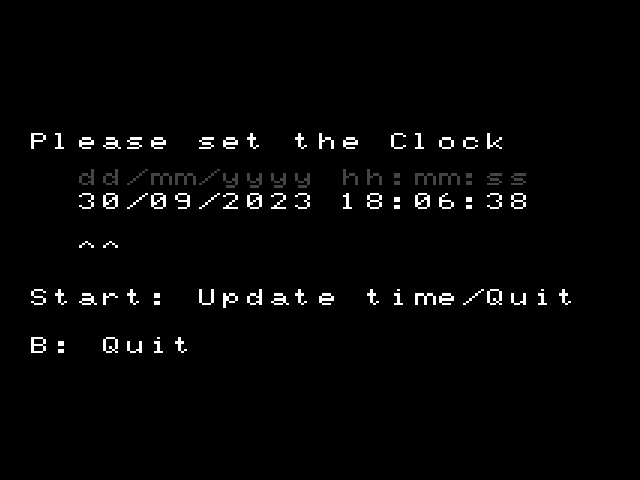

# Clock

<i>{frontMatter.description}</i>

## Presentation

Simple clock app which allows you to manually set the clock of your device. Especially useful for the Miyoo Mini which doesn't have an internal RTC (which means that the time is reset at each boot). By default, Onion preserves the current time during shutdown, and upon the subsequent boot, it is restored with 4 hours added.

If you don't want the device to restore the time on boot (e.g. you have modded your device to have hardware RTC), you can create the file `SDCARD\.tmp_update\config\.noTimeRestore`. Doing so will prevent the time restore.

:::note
On the Miyoo Mini Plus, Onion can use the WiFi connection to set the time at each boot. Configure it from [Tweaks app](tweaks#set-automatically-via-the-internet).
:::

## Usage

Clock is available in [Package Manager](package-manager).

Use the D-pad to set the current date. 

## Advanced

[Clock source code](https://github.com/OnionUI/Onion/tree/main/src/clock)
