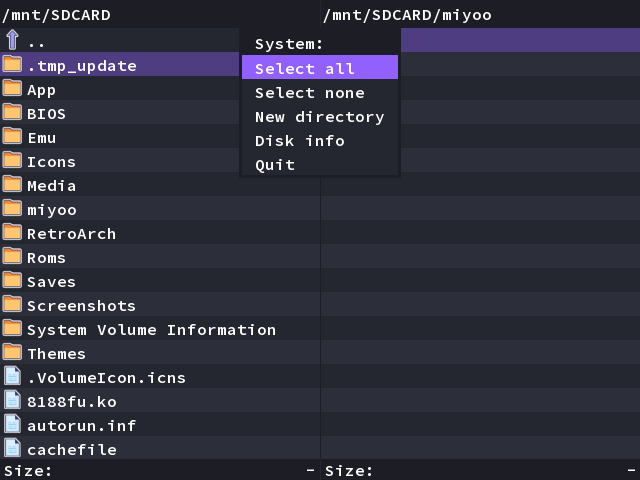

# File Explorer

## Presentation

A dual-pane file explorer that allows you to manage files directly on your device.

## Usage

File Explorer is available in [Package Manager](package-manager).

### Controls

| Button        | Function                                            |
| ------------- | --------------------------------------------------- |
| Select        | Select items                                        |
| A             | Open folder / View or execute file                  |
| B             | Move up one directory / Cancel action               |
| X             | Manage selected items (Copy/Delete/Move etc)        |
| Y/Menu button | Open general submenu (Select all/New Directory etc) |
| L1/R1         | Scroll page                                         |

## Advanced

[File Explorer / DinguxCommander source code](https://github.com/OnionUI/app-DinguxCommander/).