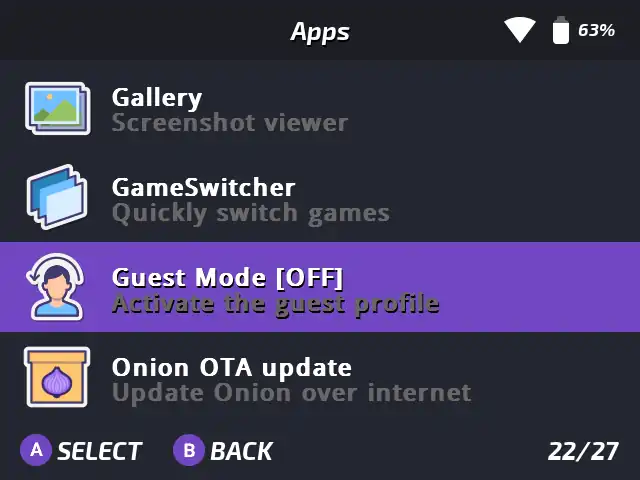
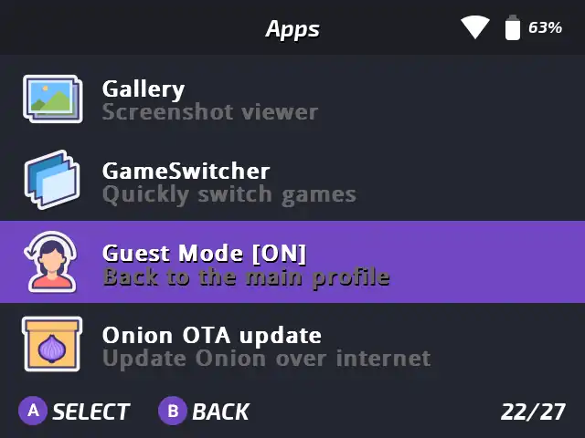

# Guest Mode

*A separate profile for your Onion*

## Presentation

Guest mode is a separate profile so you can safely lend your device to your kid or your friend.
The Guest profile will have its own save and save states. Guest mode makes the Onion experience perfect when 2 persons are using the same Miyoo Mini.

## Usage

Go in Apps section and run "Guest Mode", the icon will change to show the current state:

|                |                |
| ---------------                                 | ---------------                                |
| 
Guest mode disabled
 | 
Guest mode enabled
 |

## Advanced

The profile contains the following properties:
- Saves
- States
- Video filter and scaling options
- Core options
- Custom button remapping layouts
- RetroArch history  
  > The Game Switcher list will be different to reflect this
- RetroArch playlists and favorites
- Timers for your games  
  Play Activity app
- RGUI config  
  RetroArch Graphic User Interface
