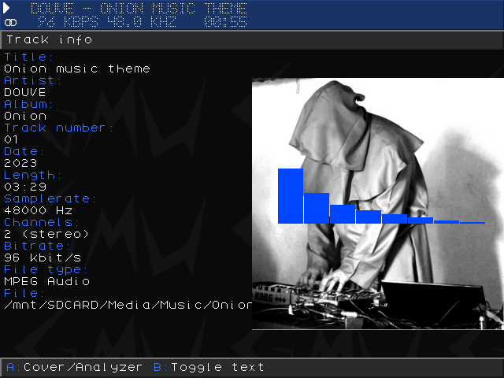

# Music Player

Gmu is a music player application.
Gmu is built in a modular way and supports various frontends and decoders for supports of different user interfaces and file formats respectively.
Gmu supports MPEG audio, Ogg Vorbis and Ogg Opus for internet audio

## Supported file formats

- Ogg Vorbis (.ogg)
- MP3 (.mp3)
- MP2 (.mp2)
- Musepack (.mpc)
- FLAC (.flac)
- Speex (.spx)
- Ogg Opus (.opus)
- WavPack (.wv, .wvc)
- Module formats (including MOD, IT, STM, S3M, XM, 669, ULT among others)
- M3U (Gmu can read and write .m3u playlists)
- PLS (Gmu can read .pls playlists)

## Keymap

### Global Controls:

| Function        | Button                              |
| --------------- | ----------------------------------- |
| play            | A  (in playlist and in filebrowser) |
| pause           | start                               |
| seek in track   | Left/Right                          |
| prev/next track | L1/R1                               |
| ToggleView      | Select                              |
| exit            | Menu + Select (similar to RA menu)  |
| help            | Menu + Start                        |

### Playlist Controls:

| Function         | Button   |
| ---------------- | -------- |
| PlayItem         | A        |
| ToggleRandomMode | X        |
| RemoveItem       | B        |
| Clear            | Menu + B |
| Save             | Menu + A |

   

[**Source page & detailed documentation**](https://github.com/schmurtzm/gmu)

