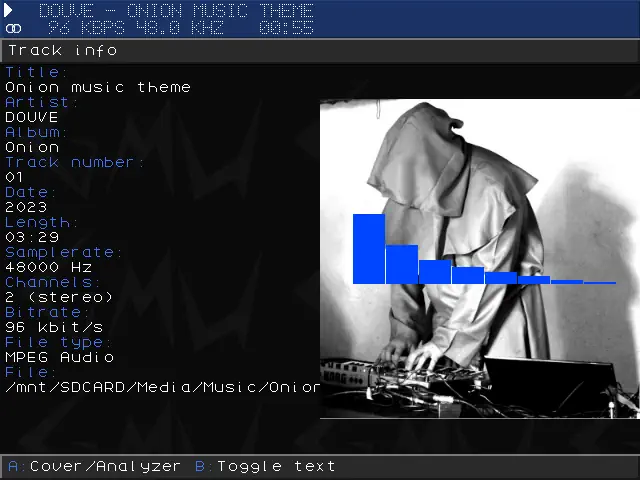

# Music Player

## Presentation

Gmu is a music player application.
Gmu is built in a modular way and supports various frontends and decoders for supports of different user interfaces and file formats respectively.
Gmu supports MPEG audio, Ogg Vorbis and Ogg Opus for internet audio

### Supported file formats

- Ogg Vorbis (.ogg)
- MP3 (.mp3)
- MP2 (.mp2)
- Musepack (.mpc)
- FLAC (.flac)
- Speex (.spx)
- Ogg Opus (.opus)
- WavPack (.wv, .wvc)
- Module formats (including MOD, IT, STM, S3M, XM, 669, ULT among others)
- M3U (Gmu can read and write .m3u playlists)
- PLS (Gmu can read .pls playlists)

## Usage

### Global Controls

| Function        | Button                                                    |
| --------------- | -----------------------------------                       |
| play            | <kbd>A</kbd>  (in playlist and in filebrowser)            |
| pause           | <kbd>start</kbd>                                          |
| seek in track   | <kbd>Left/Right</kbd>                                     |
| prev/next track | <kbd>L1/R1</kbd>                                          |
| ToggleView      | <kbd>Select</kbd>                                         |
| exit            | <kbd>Menu</kbd> + <kbd>Select</kbd> (similar to RA menu)  |
| help            | <kbd>Menu</kbd> + <kbd>Start</kbd>                        |

### Playlist Controls

| Function         | Button                         |
| ---------------- | --------                       |
| PlayItem         | <kbd>k</kbd>                   |
| ToggleRandomMode | <kbd>X</kbd>                   |
| RemoveItem       | <kbd>B</kbd>                   |
| Clear            | <kbd>Menu</kbd> + <kbd>B</kbd> |
| Save             | <kbd>Menu</kbd> + <kbd>A</kbd> |

   

[**Source page & detailed documentation**](https://github.com/schmurtzm/gmu)

