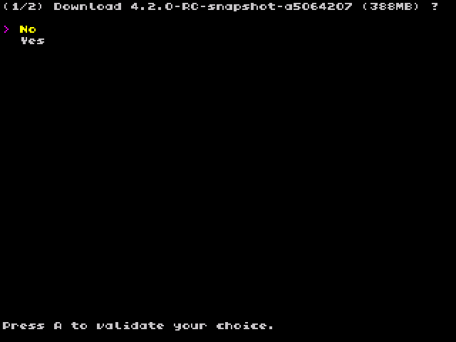

# Onion OTA update

Keep your Onion up-to-date, effortlessly!

## Presentation

Using WiFi, this app allows you to update your Onion without even touching your SD card or a computer.  
Allows you to select stable or beta channel.

## Usage

Onion OTA update is available in [Package Manager](package-manager). It will work only with WiFi/Miyoo Mini+.

Once installed run it from Apps section.

## Advanced

[Onion OTA update script](https://github.com/OnionUI/Onion/blob/main/static/build/.tmp_update/script/ota_update.sh).

### Detailed features

- stable or beta channel available (set on beta currently)
- check and enable WiFi connection if necessary
- compare current Onion version vs last released version on Github
- displays the size of the release before downloading
- verify the size of the downloaded file before applying
- check the current space available before applying update (currently 1GB is required)
- check disk integrity with fsck.fat, important to avoid SD card FAT file system corruption
- generate different exit error codes
