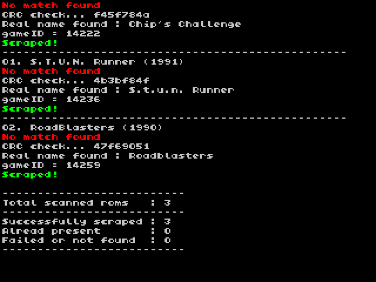
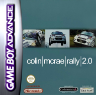
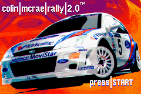
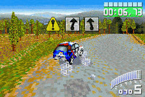
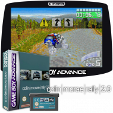

# Scraper

A missing illustration in your game list? Onion Scraper can solve that!
Using WiFi (so Miyoo Mini+ only), this app allows you to download game covers without even touching your SD card or a computer.  

https://www.youtube.com/watch?v=lOMP0ozb0I0

## Features

- Automatically download covers from 3 different sources (ScreenScraper, RetroArch and LaunchBox)
- Media type selection (Boxart, 3D, Screenshot, Title Screen, Marquee, Mix)
- Preferred region selection (will give a priority to the covers from your own region)
- Manage ScreenScraper accounts (less errors and faster when registered/logged in)
- Download one cover or all the missing covers of the current console
- Auto conversion and resize of images for the Miyoo Mini
- Find game match even if your rom is not well named thanks to ScreenScraper CRC search

  *Summary screen at end of the scraping*

## Usage

1. Select a rom in the Games submenu

2. Press <kbd>Y</kbd> to open GLO

3. Choose Scraper

## Configuration

### Media Preference
Choose the desired kind of media.

| Name        | Preview example                                   |   Available on   |
| ------------------------- | ----------------------------------- | ---------------- |
| Box Art                   |      | SS,LB,RA         |
| Screenshot - Title Screen || SS,LB,RA         |
| Screenshot - In Game      | | SS,LB,RA         |
| Box Art - 3D              |      | SS,LB            |
| Wheel                     |      | SS,LB            |
| Marquee                   |    | SS,LB            |
| ScreenScraper Mix V1      |       | SS               |
| ScreenScraper Mix V2      |       | SS               |

SS = ScreenScraper, LB = LaunchBox, RA = RetroArch

### Region selection
Choose your preferred region. If no media is found for your country code, other countries will be searched as fallback.

### Scraping source
Select where the covers will be searched.
- ScreenScraper is probably the best supplied, it supports all the media types proposed in Scraper and it also allows to search by CRC which provide a lot of additional matches
- LaunchBox offers a fast alternative to ScreenScraper
- RetroArch is quite fast but the match level is low.

### ScreenScraper: account settings

- ScreenScraper information: technical information about ScreenScraper (a retrogaming project to support)
- Username & password: to set your ScreenScraper credentials
- Account state and stats: will show your ScreenScraper account state (useful to check if your account credentials are well configured and if you don't exceed quotas)

### Toggle background Scraping

Allows to download covers in background, which means that you can use your Miyoo Mini Plus while it is downloading your covers.

