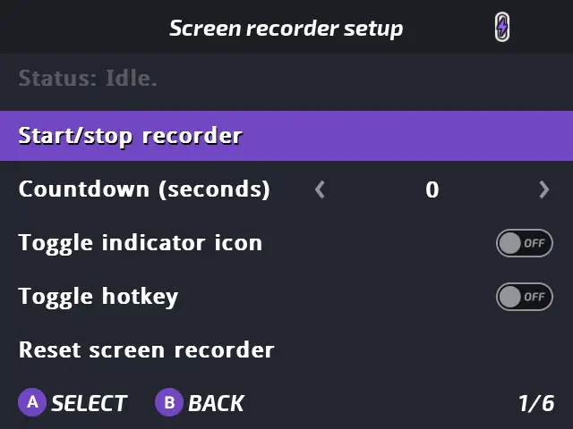

# Screen Recorder
by XK

## Presentation

Screen Recorder adds screen record ability for demoing apps/content/features/bugs.

## Features

- Record your current screen
- Recording indicator icon
- Customizable countdown before starting recording
- Hotkey to launch/stop a record from anywhere

:::note
Not really suitable to record games in current build as it's CPU encoding and the framerate is too low for a game.
:::

## Usage

You'll find it in Tweaks app: [`Tools` -› `Screen recorder...`](/docs/apps/tweaks#screen-recorder) and you'll get these options:

    - Start/Stop recorder: Launch or stop a record
    - Countdown (seconds): Countdown when starting recording. The screen will pulse white n times to signify recording has started/stopped
    - Toggle indicator icon: Flashes/Shows an icon to remind you that you're recording
    - Toggle hotkey: Enables or disables the hotkey to start/stop recording (Hold MENU+A for 2 seconds)
    - Reset screen recorder: Hardkills ffmpeg, removes all flags and stops any recording
    - Delete all recordings: A quick way to delete all recordings in the directory

Recorded videos are located in `Media\Videos\Recorded` and can be viewed with [Onion Video Player](video-player)

### Hotkeys

| Button          | Function                                 |
| --------------- | -----------------------------------      |
| <kbd>Menu</kbd>+<kbd>A</kbd> hold 2s   | Force enable/disable screen recorder |

