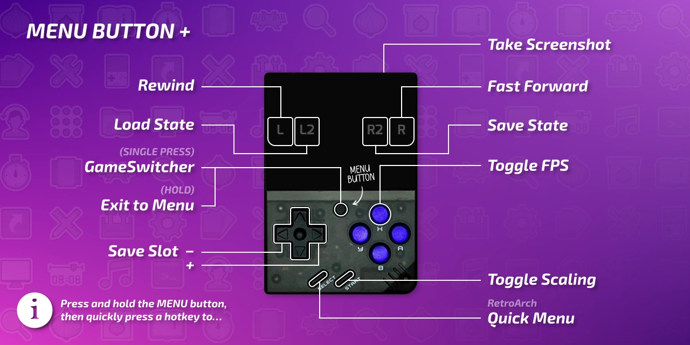

# Shortcuts

## Presentation

Shortcuts in Onion are managed by an app called `keymon`. This app has no graphical interface, it is an background daemon which will manage the shortcuts during gameplay or not.

## Usage

<table align="center">
    <thead>
        <tr>
            <th>Button combination</th>
            <th>Action</th>
            <th><em>Active...</em></th>
        </tr>
    </thead>
    <tbody>
        <tr>
            <td><kbd>MENU</kbd></td>
            <td>Launch GameSwitcher [by default]</td>
            <td><em>From MainUI</em></td>
        </tr>
        <tr>
            <td><kbd>SELECT</kbd> or <kbd>MENU</kbd> hold</td>
            <td>Open context menu [by default]</td>
            <td><em>From MainUI</em></td>
        </tr>
        <tr>
            <td><kbd>MENU</kbd> <kbd>MENU</kbd></td>
            <td>Resume last game [by default]</td>
            <td><em>From MainUI</em></td>
        </tr>
    </tbody>
    <tr class="table-separator">
        <td colspan="3">
            

        </td>
    </tr>
    <thead>
        <tr>
            <th>Button combination</th>
            <th>Action</th>
            <th><em>Active...</em></th>
        </tr>
    </thead>
    <tbody>
        <tr>
            <td><kbd>MENU</kbd></td>
            <td>Save and exit to GameSwitcher [by default]</td>
            <td><em>In-game</em></td>
        </tr>
        <tr>
            <td><kbd>MENU</kbd> hold</td>
            <td>Save and exit to menu [by default]</td>
            <td><em>In-game</em></td>
        </tr>
        <tr>
            <td><kbd>MENU</kbd> <kbd>MENU</kbd></td>
            <td>Launch second-most recent game [by default]</td>
            <td><em>In-game</em></td>
        </tr>
        <tr>
            <td><kbd>MENU</kbd> + <kbd>SELECT</kbd></td>
            <td>RetroArch quick menu</td>
            <td><em>In-game</em></td>
        </tr>
        <tr>
            <td><kbd>MENU</kbd> + <kbd>START</kbd></td>
            <td>Change aspect ratio</td>
            <td><em>In-game</em></td>
        </tr>
        <tr>
            <td><kbd>MENU</kbd> + <kbd>L</kbd></td>
            <td>Toggle rewind (if available)</td>
            <td><em>In-game</em></td>
        </tr>
        <tr>
            <td><kbd>MENU</kbd> + <kbd>R</kbd></td>
            <td>Toggle fast forward</td>
            <td><em>In-game</em></td>
        </tr>
        <tr>
            <td><kbd>MENU</kbd> + <kbd>L2</kbd></td>
            <td>Load state</td>
            <td><em>In-game</em></td>
        </tr>
        <tr>
            <td><kbd>MENU</kbd> + <kbd>R2</kbd></td>
            <td>Save state</td>
            <td><em>In-game</em></td>
        </tr>
        <tr>
            <td><kbd>MENU</kbd> + <kbd>LEFT</kbd> / <kbd>RIGHT</kbd></td>
            <td>Select save slot</td>
            <td><em>In-game</em></td>
        </tr>
        <tr>
            <td><kbd>MENU</kbd> + <kbd>X</kbd></td>
            <td>Toggle FPS display</td>
            <td><em>In-game</em></td>
        </tr>
    </tbody>
    <tr class="table-separator">
        <td colspan="3">
            

        </td>
    </tr>
    <thead>
        <tr>
            <th>Button combination</th>
            <th>Action</th>
            <th><em>Active...</em></th>
        </tr>
    </thead>
    <tbody>
        <tr>
            <td><kbd>MENU</kbd> + <kbd>POWER</kbd></td>
            <td>Take screenshot</td>
            <td><em>Always</em></td>
        </tr>
        <tr>
            <td><b>MM:</b> <kbd>SELECT</kbd> + <kbd>L2</kbd> / <kbd>R2</kbd> <b>MMP:</b> <kbd>MENU</kbd> +
                <kbd>VOL</kbd></td>
            <td>Adjust brightness</td>
            <td><em>Always</em></td>
        </tr>
        <tr>
            <td><kbd>START</kbd> + <kbd>L2</kbd> / <kbd>R2</kbd></td>
            <td>Adjust volume boost</td>
            <td><em>Always</em></td>
        </tr>
        <tr>
            <td><kbd>START</kbd> + <kbd>L2</kbd> + <kbd>R2</kbd></td>
            <td>Reset volume boost</td>
            <td><em>Always</em></td>
        </tr>
        <tr>
            <td><b>MMP:</b> <kbd>VOL+</kbd> + <kbd>VOL-</kbd></td>
            <td>Toggle mute</td>
            <td><em>Always</em></td>
        </tr>
        <tr>
            <td><kbd>POWER</kbd></td>
            <td>Sleep mode</td>
            <td><em>Always</em></td>
        </tr>
        <tr>
            <td><kbd>POWER</kbd> hold</td>
            <td>Save and turn off</td>
            <td><em>Always</em></td>
        </tr>
        <tr>
            <td><kbd>POWER</kbd> hold 5s</td>
            <td>Force shutdown</td>
            <td><em>Always</em></td>
        </tr>
        <tr>
            <td><b>MMP:</b> <kbd>POWER</kbd> hold 10s</td>
            <td>Cut off power (on regular MM you need to disconnect the battery)</td>
            <td><em>Always</em></td>
        </tr>
    </tbody>
    <tr class="table-separator">
        <td colspan="3">
            

        </td>
    </tr>
    <thead>
        <tr>
            <th>Button combination</th>
            <th>Action</th>
            <th><em>Active...</em></th>
        </tr>
    </thead>
    <tbody>
        <tr>
            <td><kbd>L2</kbd> / <kbd>R2</kbd></td>
            <td>Change color palette</td>
            <td><em>For GB only</em></td>
        </tr>
    </tbody>
</table>

## Advanced

- [Keymon source code](https://github.com/OnionUI/Onion/blob/main/src/keymon/keymon.c).