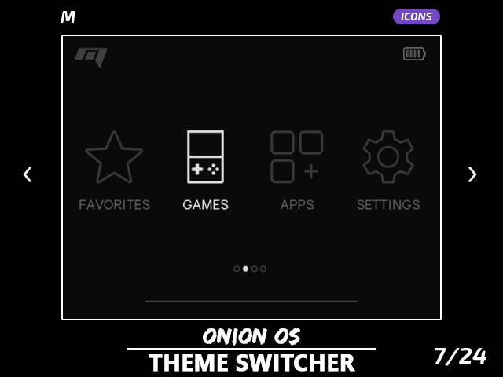

# Themes

*Change Onion theme*

## Presentation

Onion loves themes. Themes in Onion are two things:
- [A fabulous theme repository](https://github.com/OnionUI/Themes/blob/main/README.md) with a very active participation from Onion community ❤️
- An application called "Theme Switcher" included in Onion which allows to preview and change themes

 
The Game Switcher app.

here you can see that the theme impacts the main page, the consoles sub sections and the Game Switcher

## Usage

You'll find Theme Switcher in app section. It lets you preview and select your preferred theme.

When installing a theme you can choose if you want to install the icons as well, if the theme includes any.

#### To install a theme:
- Visit [Onion themes repository](https://github.com/OnionUI/Themes/blob/main/README.md)
- Download a theme to `/Themes` folder on your SD card
- Apply your theme with the Theme Switcher app

#### Icon switching

- Theme Switcher now supports themes with icon packs - *remember to visit our [themes repository](https://github.com/OnionUI/Themes/blob/main/README.md) for additional themes and icon packs!*
- Change icon pack and edit individual icons in Tweaks

<table align="center"><thead>
<th colspan="2">Icon Switching</th>
</thead><tr>
<td width="65%" align="center" rowspan="2"></td>
<td></td>
</tr><tr>
<td></td>
</tr><tr>
<td align="center">
<i>Showcase: Applying themes with icon packs</i>
</td>
<td align="center">
<i>Use Tweaks to change icon pack or edit individual icons</i>
</td>
</tr></table>

## Advanced

Learn how to make your own theme by consulting [our guide](../theme-design).

If you have a big amount of themes on your SD card, you can unzip each theme, Theme Switcher app will be faster to launch.

:::note
You can switch the icon packs without changing your current theme, directly from `Tweaks app` -> `Appearance` -> `Icons packs`
:::
