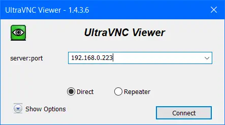

# VNC Server


Remote display and remote control of your Miyoo Mini+ from your computer thanks to VNC.


## Features

- Remote display of the Miyoo Mini+
- Remote control of the Miyoo Mini+


## Enabling VNC access

You'll find it in Tweaks app: [`Network` -› `VNC: Screen share`](/docs/apps/tweaks#vnc-screen-share).

You can either use the master toggle to turn the VNC Server on with your right/left arrows, or press A to enter the submenu and you'll get 2 options:

1. **Enable** - Activate VNC Server
2. **Framerate** - Set the framerate of the VNC Server between 1 and 20. The higher the framerate, the more CPU will be use

## Logging in


Then from your computer, you can login with any VNC client. [RealVNC](https://www.realvnc.com/fr/connect/download/viewer/) for example is declined on all platforms. UltraVNC is a Windows alternative.
You'll need the IP of the device, found below (**Tweaks** › **Network**)


Copy it to your VNC client (the default port is used so no need to specify it: 5900).

For example: 



Once connected, Keybinds need to match what MainUI/SDL is expecting, which are:

```
# A = K_SPACE
# B = K_LCTRL
# Y = K_LALT
# X = K_LSHIFT
# L = K_e
# R = K_t
# L2 = K_TAB
# R2 = K_BACKSPACE
# start = K_RETURN
# select = K_RCTRL
# menu = K_ESCAPE
```

## Security

:::caution Network security
VNC server must be used on local private network only as there is no password and no encryption. It is not recommended you use VNC on an insecure Wi-Fi network that is open or public as traffic is unencrypted, for this reason we strongly recommend you toggle VNC off when you're on the move!
:::
