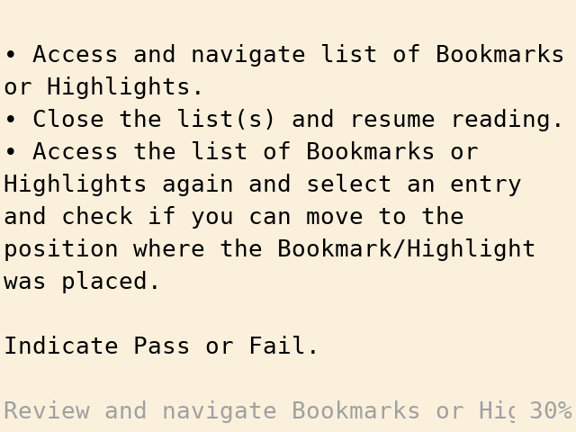

# Ebook Reader

*Pixel Reader by ealang*

## Presentation

An ebook reader app for the Miyoo Mini. Supports epub and txt formats.

## Usage

Ebook Reader is available in [Package Manager](package-manager).

### Controls

| Button | Function        |
| ------ | --------------- |
| D-pad  | Navigate        |
| A      | View bottom bar |
| B      | Close file      |
| X      | Open menu       |
| Select | Show Chapters   |
| Menu   | Exit            |

## Advanced

[Pixel Reader source code](https://github.com/ealang/pixel-reader).
