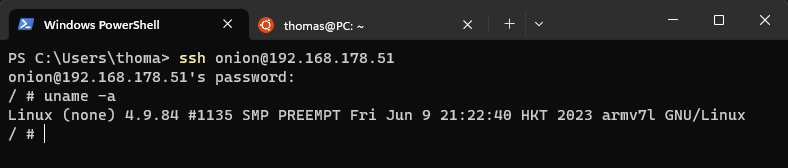

# SSH / SFTP

**

SSH provides a secure command line method to communicate with your Miyoo Mini+.

SFTP provides a secure file transfer method


## Features

**

- Virtual password auth. 

- Command-Line Interface

- Scripting and automation

- Debugging and troubleshooting

- Encrypted


## Enabling SSH

You'll find it in **Apps** › **Tweaks** › **Network** › **SSH: Secure shell** 

You can either use the master toggle to turn the SSH server on with your Right/Left arrows, or press A to enter the submenu.

In the submenu you'll get 2 options:

1. **Enable** - Activate SSH access

2. **Enable authentication** - Activate authentication (username/password)


## Logging in

:::note Default credentials
**Username:** `onion`  
**Password:** `onion`  
*We're using a new auth system, user defined passwords will come in a future update.*
:::

Once you've activated your SSH server in Tweaks you'll now be able to connect using the integrated terminal emulator in Windows, Mac or Linux or with separate software such as PuTTY, SolarPuTTY or Hyperterm. You'll also be able to use an SFTP client such as FileZilla to transfer files securely.

As an example, in most terminal emulators you can connect with the following:

```
ssh onion@ipaddress
```
You'll be prompted to enter the password, `onion`, and then you'll be greeted with a shell prompt:



You'll need the IP of the device, found below (**Tweaks** › **Network**).


## Disabling authentication

Although this is not recommended on other peoples Wi-Fi, when you're at home on your own Wi-Fi this is absolutely fine (or any other secure Wi-Fi!)

Head over to **Tweaks** › **Network** › **SSH** and toggle:


Now you can connect with the username `root` and no password.
## Security

:::caution Network security
Although we've taken every precaution to offer as much security as possible, remember to keep your Onion safe. SSH/SFTP is the most secure of the services Onion offers to communicate with your device but it is not advisable to leave SSH enabled while using public/open Wi-Fi unless you're actively using it.
:::
